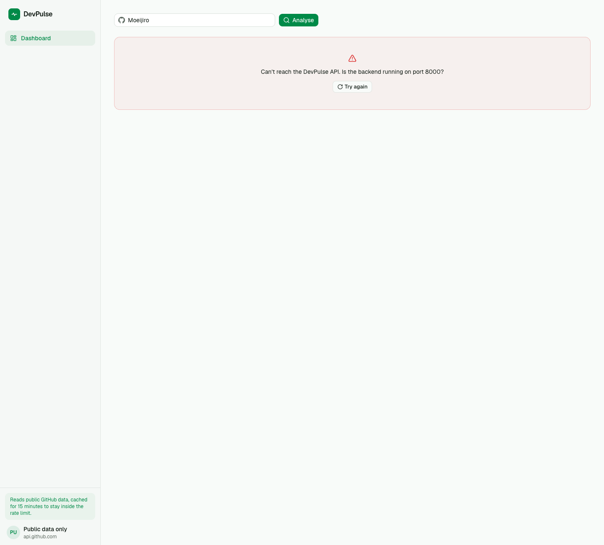
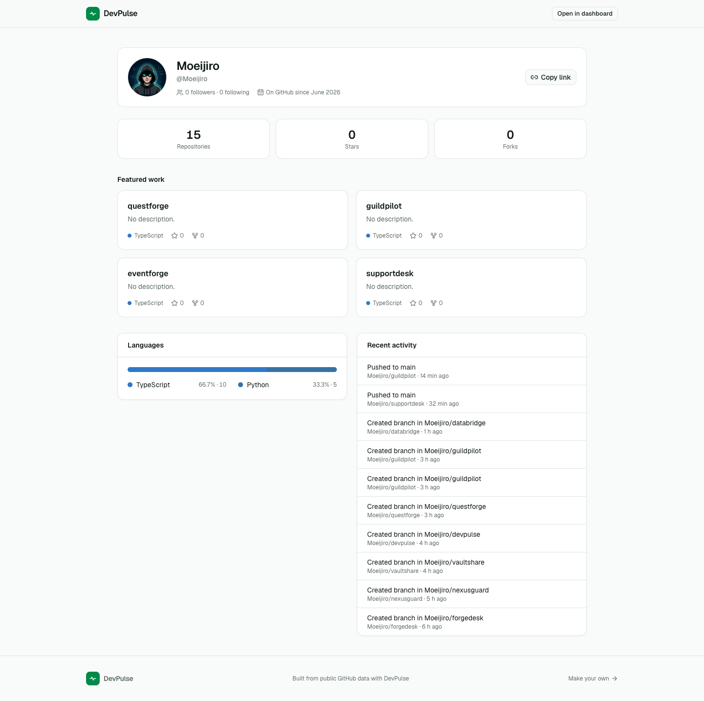
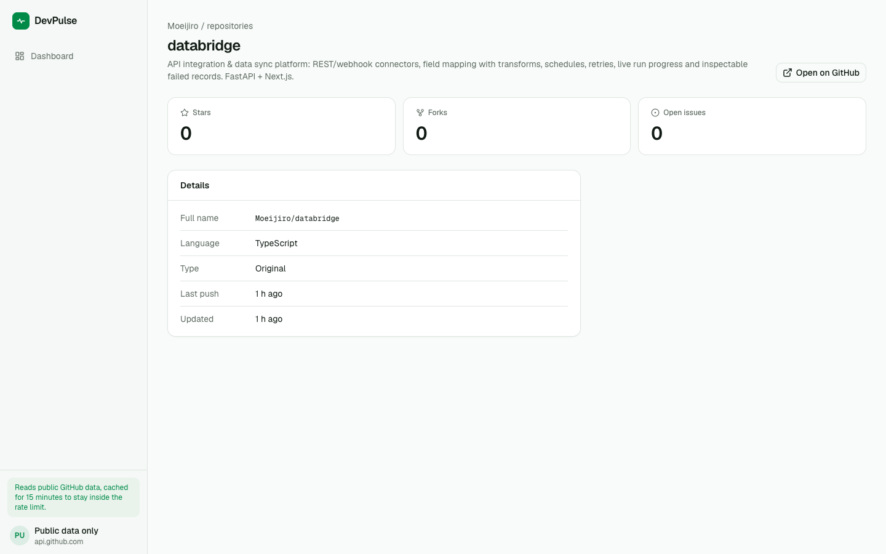
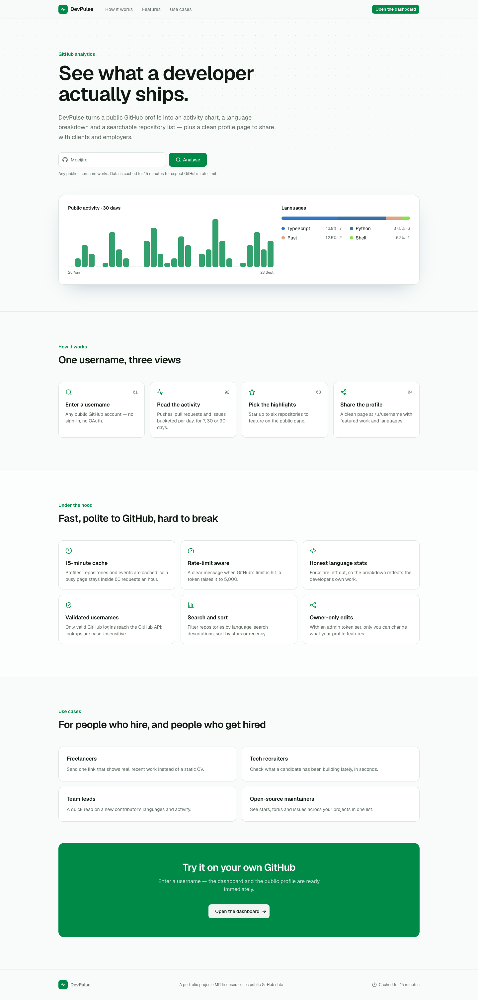
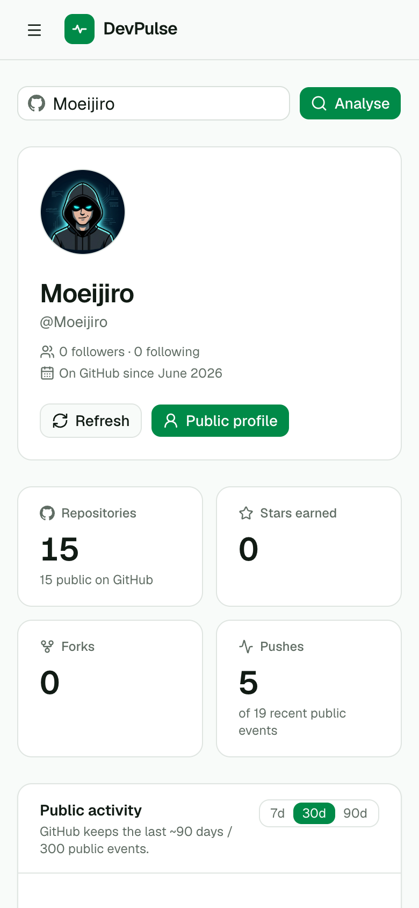
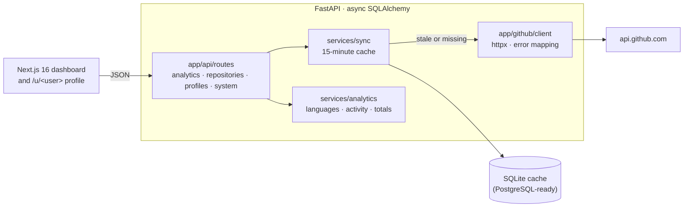
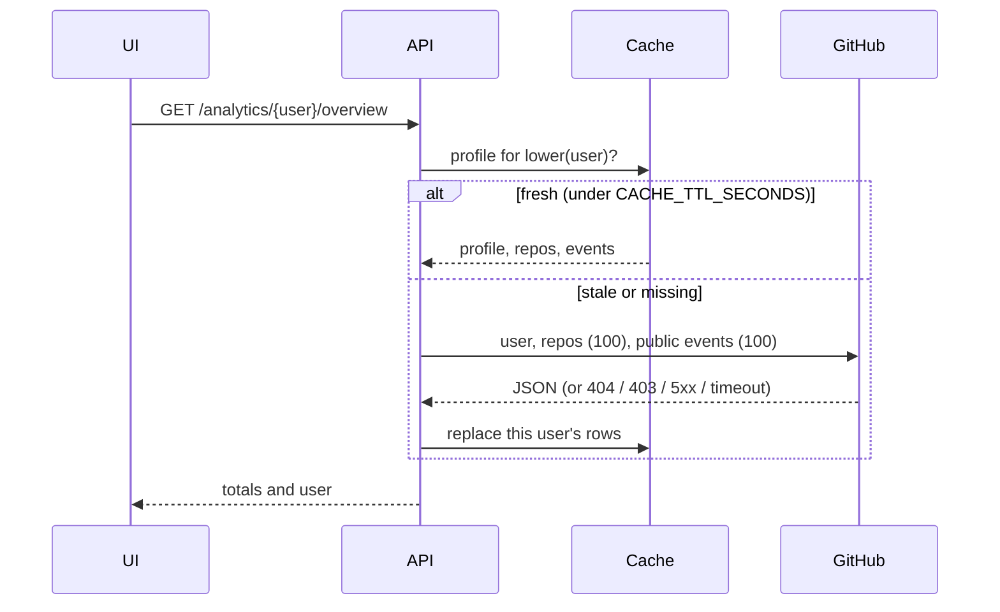

# DevPulse

**Portfolio case study:** [moeijiro.github.io/portfolio/projects/devpulse](https://moeijiro.github.io/portfolio/projects/devpulse/) · **Live demo:** not hosted — the app runs locally in a few commands (see below).

**See what a developer actually ships.** DevPulse turns any public GitHub profile into
an activity chart, a language breakdown and a searchable repository list. It also gives
each developer a clean profile page they can share with clients and employers. GitHub
data is cached for 15 minutes, so a busy page stays inside the API's rate limit.

It reads public data only. There is no OAuth, and it never reads private repositories.

> Portfolio project. The screenshots show a real public profile (`Moeijiro`), read
> through GitHub's public API.



| Shareable public profile | Repository detail |
| --- | --- |
|  |  |
| **Landing page** | **On a phone** |
|  |  |

## Contents

- [Features](#features)
- [Architecture](#architecture)
- [How data is fetched and cached](#how-data-is-fetched-and-cached)
- [Security](#security)
- [API overview](#api-overview)
- [Getting started](#getting-started)
- [Demo walkthrough](#demo-walkthrough)
- [Testing](#testing)
- [Environment variables](#environment-variables)
- [Known limitations](#known-limitations)

## Features

- **Dashboard:**
  - A profile header: name, bio, followers, location, company, blog, and account age.
  - Totals: repositories, stars, forks and recent pushes.
  - An activity chart over 7, 30 or 90 days. Hover a day to see what happened.
- **Languages:** one stacked bar in GitHub's language colours. Forks are left out, so it
  reflects the developer's own work.
- **Repositories:**
  - Search names and descriptions, filter by language, sort by recent push, stars or
    name.
  - **Star up to six** to feature them on the public profile.
- **Public profile** (`/u/<username>`): featured work, languages, recent activity and a
  copy-link button.
- **Repository detail:** stars, forks, open issues, language and last push.

## Architecture



```
backend/app
├── api/routes/     analytics, repositories, profiles, system
├── api/deps.py     GitHub username validation
├── github/         client (fetch + error mapping), normalised schemas
├── models/         cache (profile, repos, events), featured repositories
├── services/       sync (cache, case-insensitive keys), analytics (aggregation)
├── db/             base, async session
└── seed.py         warm the cache: python -m app.seed [--reset] [username ...]
frontend/src
├── app/            landing, (app)/dashboard, (app)/repo/[owner]/[name], u/[username]
└── components/     kit/ (shared house style), activity bars, language bar, user header
```

## How data is fetched and cached



One sync costs three GitHub requests. Without a token GitHub allows 60 an hour; with
`GITHUB_TOKEN` it allows 5,000.

## Security

| Concern | What DevPulse does |
| --- | --- |
| URL injection | Usernames must match GitHub's login rules before they're put into a GitHub URL (422 otherwise). |
| Cache poisoning / crashes | Cache keys are case-insensitive. `Octocat` and `octocat` used to collide on repository IDs and fail with a 500. |
| Upstream failures | Timeouts → 504, network errors and GitHub 5xx → 502, rate limit → 429, each with a readable message. |
| Profile edits | Featured names must be the user's own repositories, de-duplicated. With `ADMIN_TOKEN` set, changes need the `X-Admin-Token` header. |
| Secrets | `GITHUB_TOKEN` is only sent to api.github.com and never returned. |

## API overview

Interactive docs are at `http://localhost:8000/docs`. All paths start with `/api/v1`.

| Method | Path | |
| --- | --- | --- |
| GET | `/analytics/{user}/overview` | Totals and the user profile |
| GET | `/analytics/{user}/activity?days=7\|30\|90` | Events per day, with the day's first three events |
| GET | `/analytics/{user}/languages` | Language shares of original repositories |
| GET | `/repos/{user}?search=&language=&sort_by=` | Repositories |
| GET | `/repos/{user}/{repo}` | One repository |
| GET | `/profiles/{user}` | Public profile: featured work, languages, recent activity |
| POST | `/profiles/{user}/featured` | Set 1–6 featured repositories |
| POST | `/profiles/{user}/refresh` | Re-fetch from GitHub now |
| GET | `/system/rate-limit` | Remaining GitHub requests |

## Getting started

Requirements: Python 3.12+ and Node 20+. A network connection is needed to reach
api.github.com.

```bash
make install        # backend venv + frontend deps
make seed           # reset the cache and pre-fetch the demo profile
make api            # http://localhost:8000
make web            # http://localhost:3000
```

Without make:

```bash
cd backend && python3 -m venv .venv && .venv/bin/pip install -r requirements-dev.txt
cp ../.env.example ../.env
.venv/bin/python -m app.seed --reset
.venv/bin/uvicorn app.main:app --port 8000
cd ../frontend && npm install && npm run dev
```

## Demo walkthrough

1. Enter a GitHub username on the landing page. The dashboard defaults to `Moeijiro`.
2. Switch the activity window between 7, 30 and 90 days, and hover a bar.
3. Filter the repositories by language, then star one to feature it.
4. Open **Public profile** and copy the link.

## Testing

```bash
make test           # 13 tests
```

GitHub is replaced by fixtures, so the suite runs offline. The tests cover:
- language and activity aggregation, and totals
- the overview, languages and repository endpoints, with search and filters
- featured repositories: they must exist, and duplicates are removed
- the admin token
- case-insensitive lookups
- username validation
- GitHub outages returning 502
- push summaries

CI runs the backend tests, then lints and builds the frontend
([.github/workflows/ci.yml](.github/workflows/ci.yml)).

## Environment variables

See [.env.example](.env.example).

| Variable | Default | |
| --- | --- | --- |
| `DATABASE_URL` | `sqlite+aiosqlite:///./devpulse.db` | Any async SQLAlchemy URL |
| `CORS_ORIGINS` | `http://localhost:3000,…` | Browser origins allowed to call the API |
| `GITHUB_TOKEN` | — | Optional; raises the GitHub limit to 5,000 requests an hour |
| `CACHE_TTL_SECONDS` | `900` | How long GitHub data is reused |
| `ADMIN_TOKEN` | — | Optional; required as `X-Admin-Token` to change featured repositories |

## Known limitations

- Activity is limited to what GitHub's public events API keeps: about 90 days and 300
  events. It isn't the contribution calendar.
- Only the 100 most recently updated repositories are read.
- Without `ADMIN_TOKEN`, anyone can change which repositories a profile features.
- Stars and languages come from GitHub as-is. There is no history over time.

## License

MIT © Moeijiro
